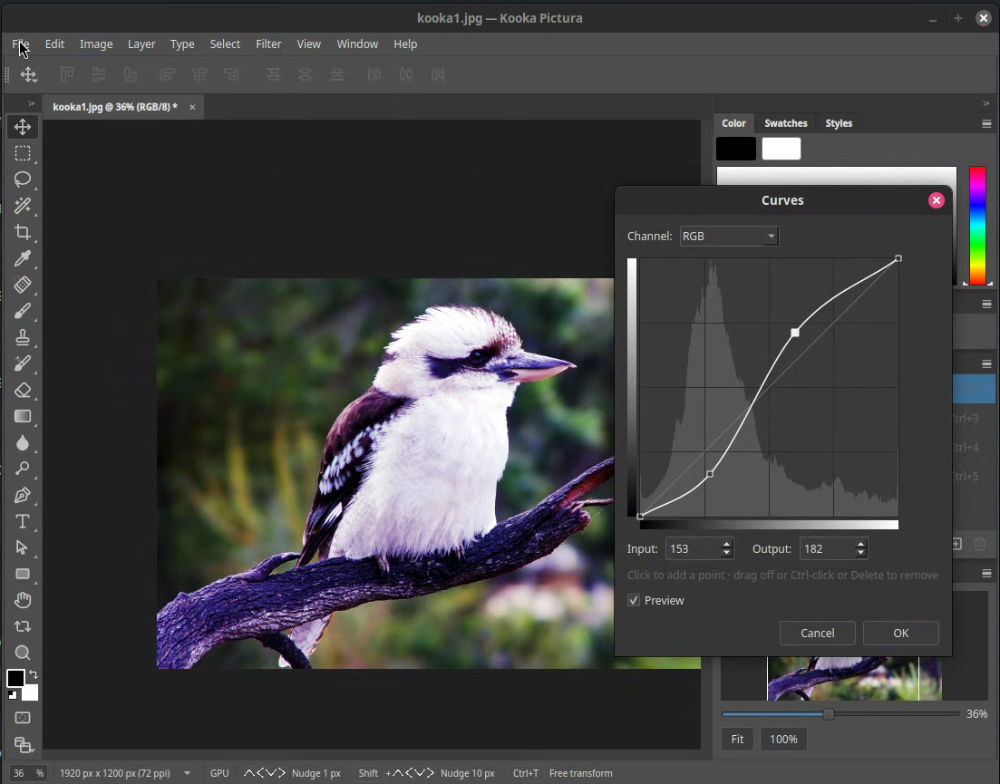

# Kooka Pictura

A layered photo editor for Linux, built to edit photos well and to read and
write Photoshop (PSD/PSB) files faithfully.

[](https://github.com/KookaStudio/KookaPictura/actions/workflows/ci.yml)
[](LICENSE)




## What it is

Kooka Pictura is an independent, from-scratch image editor for Linux. The engine
is Rust; the interface is Qt 6. It is a working application, not a mock-up: it
opens and saves PSD/PSB, composites layers on the CPU with an optional GPU path,
and ships a large slice of the classic Photoshop tool, layer, adjustment, and
filter surface.

The goal is a photo editor that handles the editing workflow really well, not a
clone of every corner of Photoshop. For what is in and out of scope, see
[`ROADMAP.md`](ROADMAP.md).

## Getting it

Kooka Pictura is not packaged for download yet. You build it from source.

Requirements: Rust 1.98, Qt 6, CMake, Ninja, `lld`, and the Little CMS 2 headers.

```bash
cmake -S . -B build -G Ninja -DCMAKE_EXE_LINKER_FLAGS=-fuse-ld=lld
cmake --build build --parallel
./build/pictura
```

Full prerequisites, test commands, and packaging notes are in
[`DEVELOPING.md`](DEVELOPING.md). Installers (Flatpak, AppImage, `.deb`) are on
the roadmap.

## Quick start

1. `File > Open…` a PSD/PSB file, or any PNG, JPEG, GIF, BMP, TIFF, or WebP.
2. Edit with the toolbox and panels: paint, select, crop, add adjustment and
   fill layers, apply filters.
3. `File > Save` writes PSD/PSB, preserving the file's color mode, bit depth,
   layers, effects, smart objects, metadata, and profiles.

## Features

- **PSD/PSB round-trip.** Reads and writes Gray, RGB, CMYK, Lab, Indexed, and
  Bitmap at 8/16/32-bit, with raw, RLE, and ZIP compression, preserving blocks
  the engine does not model.
- **Layers.** Groups and nesting, raster and vector masks, 27 blend modes,
  layer styles and effects, fill and adjustment layers, layer locks, color
  labels, and layer filtering.
- **Smart objects.** Embedded smart objects with a bundled, non-destructive
  editing flow and smart filters.
- **Pictura Raw.** The built-in raw processor (the equivalent role to Adobe
  Camera Raw, which is an add-on in Photoshop), reached through
  `Filter > Pictura Raw…`.
- **Adjustments and filters.** All the usual adjustment families plus the full
  classic filter set — blur, sharpen, noise, stylize, pixelate, distort,
  render, and the artistic families.
- **Selections.** Marquee, ellipse, lasso, magic wand, and quick selection, with
  save/load to channels, selection-masked edits, and content move.
- **Color management.** ICC profiles, Assign and Convert Profile, and
  configurable handling of an incoming embedded profile.
- **Metadata.** EXIF/IPTC/XMP reading and editing, File Info, and metadata
  templates.
- **Fast.** A Vulkan (wgpu) compute path accelerates compositing and the heavy
  filters, with the CPU as the reference.
- **Headless and scriptable.** A non-interactive `--headless` mode and an
  optional local control server for automated editing.

## What it is not

Kooka Pictura focuses on photo editing. It does not aim for Photoshop's product
family features — 3D, video, DICOM measurement, print fidelity, cloud services,
or Adobe plug-in compatibility. [`ROADMAP.md`](ROADMAP.md) lists these
explicitly. Adobe, Photoshop, and Camera Raw are trademarks of Adobe Inc.; this
project is independent and ships no Adobe code or assets.

## A note on AI

AI and LLM coding agents are part of how Kooka Pictura is built. This is an
agentic-coding project: agents write and review code alongside human
contributors, and that use is disclosed rather than hidden. The approach follows
the [Software Freedom Conservancy's recommendations for LLM-backed generative
AI in FOSS](https://sfconservancy.org/llm-gen-ai/llm-backed-generative-ai-recommendations.html):

- Every contribution is human-reviewed. Manual testing of fixes and features is
  highly recommended before they land.
- Using AI tools is optional; contributors who do not are equally welcome.
- All code stays GPL-3.0-or-later, and the provenance rules in
  [`CONTRIBUTING.md`](CONTRIBUTING.md) apply however it was written.

The agent tooling and the required spec workflow are in
[`DEVELOPING.md`](DEVELOPING.md#ai-assisted-development).

## Get help

Open an issue at
[github.com/KookaStudio/KookaPictura/issues](https://github.com/KookaStudio/KookaPictura/issues).

## For developers

- [`DEVELOPING.md`](DEVELOPING.md) — onboarding, build, test, and architecture.
- [`CONTRIBUTING.md`](CONTRIBUTING.md) — provenance, asset, and dependency rules.
- [`ROADMAP.md`](ROADMAP.md) — shipped, planned, and not planned.
- [`docs/README.md`](docs/README.md) — how to read the specification corpus.
- [`docs/dev/STATE.md`](docs/dev/STATE.md) — the project resume anchor.

## License

Kooka Pictura is free software under the **GNU GPL v3.0 or later**
(see [`LICENSE`](LICENSE)). Third-party component licenses are listed in
[`THIRD-PARTY-LICENSES`](THIRD-PARTY-LICENSES) with texts under
[`LICENSES/`](LICENSES/).
